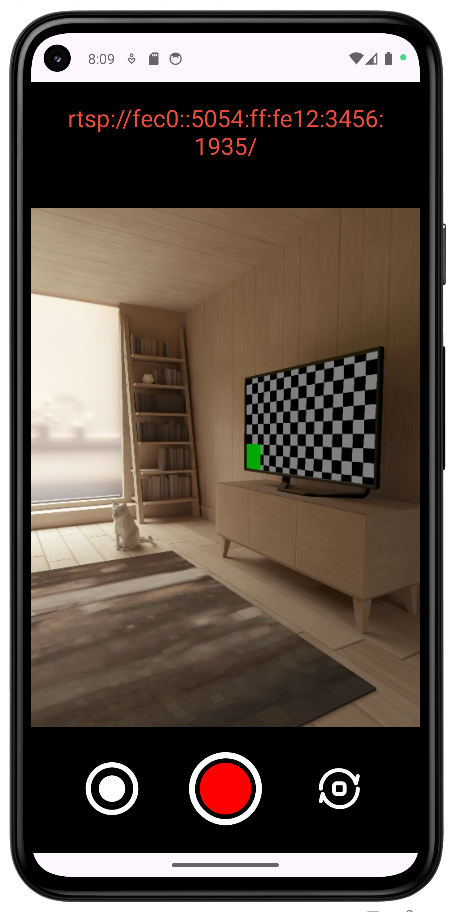

# CamStreamAndroidToPython


## Project Description

This project demonstrates how to stream live camera footage from an Android device using RTSP and perform object detection on the stream using YOLO (You Only Look Once) in Python. The Android application captures the camera feed and streams it over RTSP, while the Python script processes this stream to detect objects using the YOLO model.

## Features

- **Android Application**:

   - Captures live camera feed.
   - Streams the camera feed via RTSP.
   - Uses `CameraX` for camera functionalities.
   - Implements `ViewModel`, `LiveData`, and `Snackbar` for error and success messages, following the MVVM architecture.

- **Python Script**:

   - Connects to the RTSP stream from the Android application.
   - Uses YOLO for object detection.
   - Captures a 5-second GIF from the stream.
   - Displays real-time object detection with bounding boxes and labels.

## Prerequisites

- **Android**:

   - Android Studio
   - Minimum SDK version 21
   - Recommended target SDK version 34

- **Python**:

   - Python 3.6 or higher
   - OpenCV
   - Ultralytics YOLO
   - PyTorch
   - imageio

## Installation

### Android

1. **Clone the repository**:

```sh
git clone https://github.com/oaslananka/CamStreamAndroidToPython.git
cd CamStreamAndroidToPython/android/CameraXRTSPStreaming
```

2. **Open the project in Android Studio**:

3. **Build the project:**

- Android Studio will automatically download the necessary dependencies.

### Python

1. **Navigate to the Python project directory:**

```sh
cd ../python/stream_processing
```

2. **Install the required Python packages:**
```sh
pip install -r requirements.txt
```

2. **Run the Python script:**

```sh
python main.pyxt
```

### Acknowledgements
- YOLO (You Only Look Once): Real-time object detection system. [YOLO GitHub](https://github.com/ultralytics/ultralytics)
- OpenCV: Open Source Computer Vision Library. [OpenCV GitHub](https://github.com/opencv/opencv)
- PyTorch: Deep learning framework. [PyTorch GitHub](https://github.com/pytorch/pytorch)
- RTSP Server (pedroSG94) : Library for streaming RTSP on Android. [RTSP-Server GitHub](https://github.com/pedroSG94/RTSP-Server)



